# Emception

A complete C/C++ toolchain — clang, lld, wasm-opt, emcc — running entirely in the browser as WebAssembly. Compile, link, and execute C/C++ from a web page. No local toolchain, no server.

[](LICENSE)

## Which package do I need?

Most consumers do **not** build from source. Pick a published package:

| I want to…                                      | Install                                                               | Entry point                                               |
| ----------------------------------------------- | --------------------------------------------------------------------- | --------------------------------------------------------- |
| Drop a "compile + run" widget into static HTML  | `@gameguild/emception-webcomponent` + `@gameguild/emception-browser`  | `<emception-run>` custom element                          |
| Embed in a React 19 app (Next.js, Vite, CRA)    | `@gameguild/emception-react` + `@gameguild/emception-webcomponent` + `@gameguild/emception-browser` | `<EmceptionRun>` + `useEmception()`                       |
| Add a real terminal UI                          | `@gameguild/emception-xterm` + `@xterm/xterm`                         | `fromXterm()` / `toXterm()` adapters                      |
| Build a full IDE shell (editor + tabs + canvas) | `@gameguild/emception-ide`                                            | `<Ide>` React component, `<emception-ide>` custom element |
| Add a new runtime adapter or preset             | `emception`                                                           | `RuntimeAdapter` interface, presets, UI config            |

Bundled CDN payload:

- **`emception/cdn/*`** — manifest, Brotli bundles, and the browser decompressor.

Optional peer:

- **`@xterm/xterm`** — needed if you mount a terminal UI.

## Quick start

### Headless API

```ts
import { createEmception } from '@gameguild/emception-browser';

const em = await createEmception({ manifestUrl: '/cdn/manifest.json', tty: 'none' });

await em.writeFile(
  '/home/user/main.c',
  `
  #include <stdio.h>
  int main(){ puts("hi"); return 0; }
`,
);

const compile = await em.run('clang', ['/home/user/main.c', '-o', '/home/user/a.out']);
if (compile.exitCode !== 0) console.error(compile.stderr);

const run = await em.run('/home/user/a.out', []);
console.log(run.stdout);

em.dispose();
```

Surface: `run`, `readFile`, `writeFile`, `listDir`, `resetVfs`, `dispose` (typed inline in `packages/browser/src/createEmception.ts`).

### Drop-in IDE

```tsx
import { Ide } from '@gameguild/emception-ide';

<Ide
  manifestUrl="/cdn/manifest.json"
  workspaceName="lesson-3"
  workspaceConfig={{ files: [{ path: '/home/user/main.c', content: source }] }}
  enableCanvas // SDL3 / raylib graphics demos
/>;
```

### Tutorial widget (read-only)

```tsx
<Ide
  title="Lesson 3 — Pointers"
  manifestUrl="/cdn/manifest.json"
  workspaceUrl="/lessons/3/workspace.json"
  enableFileExplorer={false}
  enableCanvas={false}
  showSolutionFiles={false}
/>
```

## What's inside?

| Layer             | Tech                                              |
| ----------------- | ------------------------------------------------- |
| Compiler backend  | LLVM + Clang (compiled to WASM)                   |
| Optimiser         | Binaryen (compiled to WASM)                       |
| Emscripten driver | CPython (compiled to WASM) running `emcc.py`      |
| Build systems     | CMake + Ninja (compiled to WASM)                  |
| Graphics          | SDL3, raylib, Dear ImGui (WebGL2 + GLFW3)         |
| Kernel            | TypeScript (process manager, VFS, IPC, scheduler) |
| Terminal          | xterm.js                                          |

Each tool runs as an **isolated WASM process** with its own 2 GB linear memory. The TypeScript kernel mediates filesystem and IPC. Cross-browser async I/O works via Asyncify (no JSPI required).

## Documentation

- [Architecture](./docs/architecture.md) — micro-kernel design, kernel components, tool registry, subprocess dispatch, graphics runtimes
- [Virtual filesystem](./docs/vfs.md) — LazyFS bundle loading, IDBFS layers, Asyncify async I/O, stream callbacks
- [Building from source](./docs/build.md) — full pipeline, build flags, bundle classification, version detection
- [Pipeline diagram](./sequence.mermaid) — visual overview of the build pipeline and runtime path

## Repository layout

```
tools/emception/
├── packages/
│   ├── browser/       # @gameguild/emception-browser – createEmception() factory, worker boot
│   ├── core/          # emception            – kernel, VFS, tool runner, shell, published cdn/
│   ├── ide/           # @gameguild/emception-ide – React IDE shell (editor + tabs + canvas)
│   ├── react/         # @gameguild/emception-react – React bindings, hooks
│   ├── webcomponent/  # @gameguild/emception-webcomponent – <emception-run> / <emception-ide>
│   └── xterm/         # @gameguild/emception-xterm – xterm.js adapters
├── scripts/           # TypeScript build pipeline (tsx)
└── docs/              # Architecture, VFS, build docs

Demo apps live at the repository root instead:
`demos/emception-ide-react/`, `demos/emception-ide-next/`,
`demos/emception-run-react/`, `demos/emception-run-webcomponent/`.
```

## Demos

| Demo         | Path              | Stack       | Run                          |
| ------------ | ----------------- | ----------- | ---------------------------- |
| React + Vite | `demos/emception-ide-react/` | React, Vite | `npm install && npm run dev` |
| Next.js      | `demos/emception-ide-next/`  | Next.js 15  | `npm install && npm run dev` |

Both demos sync CDN assets from the built CDN payload automatically.

## License

MIT — see [LICENSE](LICENSE).

## Simplified Architecture Diagram

```mermaid
flowchart TD

  subgraph Build1["Step 1 - build:toolchain"]
    direction LR
    EMSDK[emsdk] --> EmCC[emcc / em++]
    EmCC --> P1Out["clang.wasm  lld.wasm  python.wasm<br/>wasm-opt.wasm  cmake.wasm"]
  end

  subgraph Build2["Step 2 - build:sdl3 + build:raylib + build:imgui"]
    direction LR
    SDL3Src[SDL3] -->|emcmake| SDL3Lib[libSDL3.a] -->|emcc MODULARIZE| SDL3Mjs[sdl3-runtime.mjs]
    RaylibSrc[raylib] -->|emcmake GLES3| RaylibLib[libraylib.a] -->|emcc GLFW3 WebGL2| RaylibMjs[raylib-runtime.mjs]
    RaylibSrc -->|header-only| Companions["libraygui  libphysac  librlights"]
    ImguiSrc[imgui] -->|emcc| ImguiLib[libimgui.a]
  end

  subgraph Build3["Step 3 - build:sysroot"]
    direction LR
    BrotliSrc[brotli-wrapper.c] -->|emcc| BrotliWasm[brotli_wasm.wasm]
    PatchGlue[patch:glue]
    P3Bin["sysroot/usr/bin/<br/>6 tool WASMs"]
    P3Lib["sysroot/usr/lib/<br/>libs + runtime.mjs + brotli + glue"]
    P3Inc["sysroot/usr/include/<br/>C++ + raylib/ + SDL3/ + imgui/"]
    BrotliWasm --> P3Lib
    PatchGlue --> P3Lib
  end

  Build1 -->|6 tool WASMs| Build3
  Build2 -->|libs + headers| Build3

  subgraph Build4["Step 4 - build:cdn"]
    direction LR
    Manifest["manifest.json<br/>13 282 files"]
    TBundles["Tool Pairs x6<br/>clang  lld  python<br/>wasm-opt  ninja  cmake"]
    CBundles["Cache Sub-Bundles x8<br/>crt  core  libcxx-variants<br/>libc-variants  gl-variants<br/>wasmfs  sanitizers  misc"]
    SDL3Bun["sdl3<br/>libSDL3.a + SDL3/ headers"]
    PBundles["Prefix Groups x11<br/>raylib  imgui  clang-headers<br/>usr-include  emscripten-core<br/>python-runtime  usr-bin<br/>libcurl  usr-share  home"]
    MiscBun["usr-lib-misc<br/>catch-all"]
    CDN["public/cdn/<br/>~29 x .tar.br  ~182 MB"]
    Manifest -->|pass 1| TBundles
    Manifest -->|pass 2a| CBundles
    Manifest -->|pass 2b| SDL3Bun
    Manifest -->|pass 2c| PBundles
    Manifest -->|pass 3| MiscBun
    TBundles & CBundles & SDL3Bun & PBundles & MiscBun -->|brotli Q11 parallel| CDN
  end

  Build3 -->|scan + sha256| Build4

  subgraph Build5["Step 5 - build:lib"]
    direction LR
    CoreTs[emception/core] -->|tsup+tsc| CoreDist[dist/core ESM]
    IdeTs[emception/ide] -->|tsup+tsc| IdeDist[dist/ide ESM]
    ReactTs[emception/react] -->|tsup+tsc| ReactDist[dist/react ESM]
  end

  Build4 --> Build5

  subgraph Browser["Browser Runtime"]
    direction TB
    HostApp[Host App] -->|new Worker| WebWorker[Web Worker emception/core]
    WebWorker -->|fetch| ManifestFetch[manifest.json from /cdn/]
    ManifestFetch -->|on-demand per bundle| LazyFS["LazyFS  fetch .tar.br + decompress<br/>populate IndexedDB lazyfs-cache-v3"]

    subgraph VFSLayer["OverlayFS  routes reads/writes by path"]
      direction LR
      IDB_RO["IndexedDB lazyfs-cache-v3<br/>usr/ etc/  read-only toolchain<br/>RAM hot-cache via Asyncify"]
      IDB_RW["IndexedDB overlay-writes<br/>home/  persistent writes<br/>write-through RAM cache"]
      TmpFS["volatile Map<br/>tmp/  in-memory only<br/>discarded after each run"]
    end

    LazyFS --> VFSLayer
    VFSLayer --> Shell[Shell ready]
    Shell -->|user edits C++| Monaco[Monaco Editor]
    Monaco -->|click Run| CompileStep{Compile path}
    CompileStep -->|C++ only| ClangPath["clang.wasm + wasm-ld<br/>clang lld cache-crt cache-core clang-headers"]
    CompileStep -->|SDL3 project| SDL3Path["cmake + ninja<br/>sdl3 bundle"]
    CompileStep -->|raylib project| RaylibPath["cmake + ninja<br/>raylib bundle"]
    CompileStep -->|full emcc| EmccPath["python.wasm + emcc<br/>emscripten-core python-runtime"]
    ClangPath & SDL3Path & RaylibPath & EmccPath --> WASMOut[app.wasm]
    WASMOut -->|fetch from VFS| RuntimeMjs[raylib-runtime.mjs or sdl3-runtime.mjs]
    RuntimeMjs -->|patch for canvas| PatchedRuntime["patched factory<br/>wasmImports + GL + GLFW"]
    PatchedRuntime -->|dynamic import| WasmInst[WebAssembly.instantiate app.wasm]
    WasmInst -->|library_glfw.js WebGL2| Canvas[Canvas  RAF loop 60 fps]
  end

  Build4 -->|CDN bundles| Browser
  Build5 -->|SDK| Browser
```


