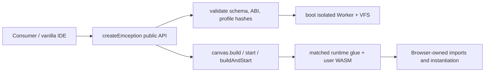

# Architecture

Emception runs an Emscripten C/C++ toolchain in the browser. Its public
packages and its generated artifacts have separate owners so UI code never
needs to understand Emscripten glue internals.

## Package boundaries

| Layer | Package | Owns | Must not own |
| --- | --- | --- | --- |
| Artifact release | `@gameguild/emception-toolchain` | schema-v2 manifest, Brotli bundles, generated glue, matching WASM, ABI profiles | browser or UI behavior |
| Runtime-neutral contracts | `emception` | API types, VFS contracts, build/test engines, presets | DOM, Worker creation, artifact publication |
| Browser runtime | `@gameguild/emception-browser` | Worker boot, manifest validation, workspace persistence, stdin/stdout adaptation, canvas build and execution | IDE layout or host-product features |
| Terminal adapter | `@gameguild/emception-xterm` | xterm byte-stream adaptation | runtime orchestration |
| Vanilla IDE | `@gameguild/emception-ide` | editor, tabs, file explorer, terminal/canvas presentation | generated glue patches, raw WASM instantiation, host-product integration |

React and custom-element packages are presentation adapters over the same
public Browser API. A product-specific editor can compose these packages, but
that integration is not part of the vanilla IDE.

## Why `.mjs` and `.wasm` are coupled

An Emscripten output is a pair, not two interchangeable files:

- the generated `.mjs` factory defines the JavaScript imports, runtime helpers,
  filesystem hooks, lifecycle, canvas bindings, and expected exported symbols;
- the `.wasm` module imports and exports the exact ABI consumed by that factory;
- Emscripten flags and version changes can change either side of this contract.

Therefore, “uncoupling the WASM” does not mean loading arbitrary glue and WASM
independently. It means moving ownership of the pair out of the IDE and making
the coupling explicit and verifiable in the artifact release.

Every matched pair is represented by a schema-v2 manifest profile containing
its glue path, WASM path, import/export lists, profile hash, artifact version,
runtime ABI, and glue patch-set version. The Browser rejects an unsupported ABI
or malformed profile before it initializes the VFS.

## Build-time flow

```mermaid
flowchart LR
  Lock[toolchain.lock.json] --> Sources[.cache/toolchain sources and builds]
  Overlays[toolchain/overlays] --> Sources
  Sources --> Mutable[artifacts/toolchain/sysroot]
  Mutable -->|stage| Stage[artifacts/toolchain/stage/sysroot snapshot]
  Stage -->|patch:glue| Patched[versioned patches on staged glue only]
  Patched -->|manifest + bundles| Release[artifacts/toolchain/release/cdn]
  Release -->|bundles + hashes| Toolchain[@gameguild/emception-toolchain/cdn]
  Release -. compatibility copy .-> Core[emception/cdn]
```

The mutable sysroot under `artifacts/toolchain` is build input. Release scripts
only accept its frozen staged snapshot, so packaging cannot silently mutate or
publish the working tree. `stage-sysroot.mjs` records a content fingerprint and
file count before release processing.

Generated glue patches live in `scripts/lib/glue-patches.mjs`. They are:

- applied only to the staged snapshot;
- versioned as part of the runtime ABI (`emception-glue-v3`);
- idempotent for a recognized generated shape;
- fail-fast when Emscripten emits an unknown shape;
- tested independently by the script suite.

Canvas runtimes retain both `*-runtime.mjs` and their generated
`*-runtime.wasm` stub. SDL3, raylib, and Allegro pairs are patched and profiled
the same way as compiler/tool pairs.

## Runtime flow



`@gameguild/emception-browser` is the only UI-facing package that knows how to
turn artifact profiles into running browser modules. Its canvas surface owns:

1. choosing the native toolchain preset;
2. compiling and linking the user artifact;
3. loading the profiled runtime factory from the VFS;
4. constructing WASI/Emscripten imports and selecting the canvas;
5. starting and stopping the module session.

The IDE calls this public surface and handles only UI state. It does not import
`WorkerClient`, call `bootInWorker`, patch generated JavaScript, inspect raw
WASM imports, or instantiate `WebAssembly.Module` directly.

## Kernel model

Each compiler or tool runs as an isolated WASM process with its own linear
memory. The core orchestrator mediates VFS operations, subprocess dispatch,
streams, cancellation, and test execution. Browser-specific Worker and
IndexedDB behavior is supplied by the Browser adapter.

`emcc` runs as CPython and cannot use native `subprocess.Popen`. The staged
Emscripten glue exposes a controlled system callback; the Browser Worker
dispatches requested tools through the same process manager and VFS.

## Architectural invariants

- A published toolchain release is immutable and versioned.
- Glue and WASM are always shipped and validated as a profile pair.
- Generated-code patches occur during release construction, never in the IDE.
- The Browser owns browser execution; the IDE consumes its public API.
- The core remains runtime-agnostic and DOM-free.
- The vanilla IDE contains no host-product behavior or branding.

See [Building from source](./build.md) for the executable release pipeline and
[Virtual filesystem](./vfs.md) for the filesystem layers.
